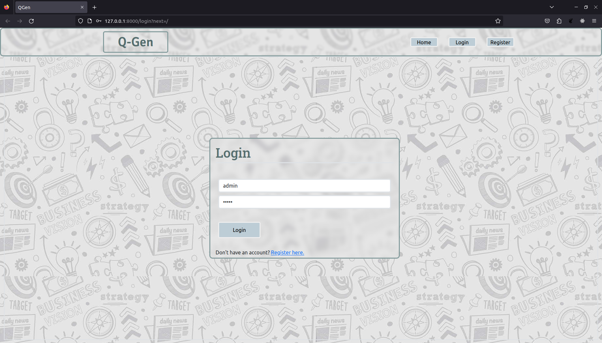
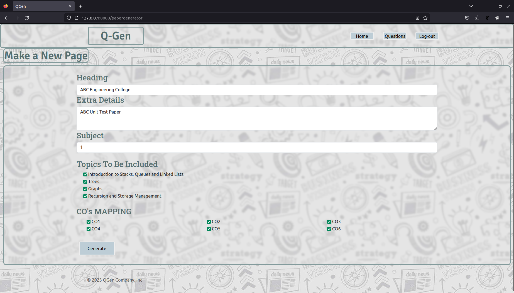
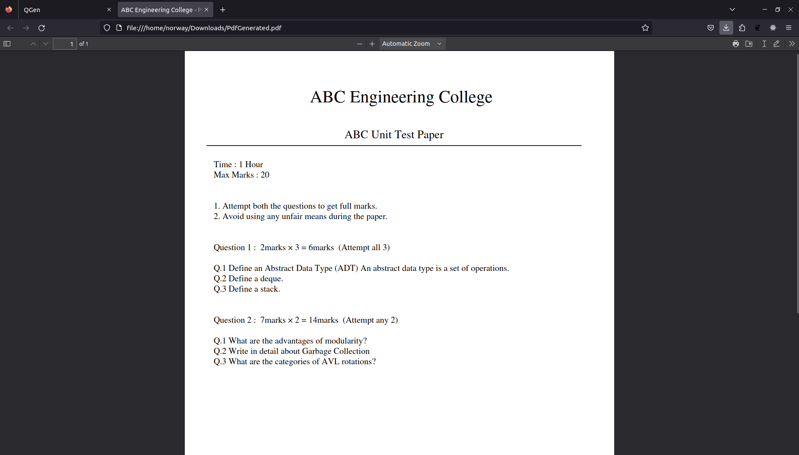

# **QGen**
#### QGen - Question Paper Generator
 

## Requirements :
#### Python 3.10+
#### Django 4.2.1+
#### Reportlab
 

## How to Run :
#### Open Terminal in project root directory.
#### Type the following : `python manage.py runserver`
 

## Default Credentials :
#### username : admin
#### password : admin
 

## Preview : 
#### Login Page.

#### Application Interface Page.

#### Generated PDF.
